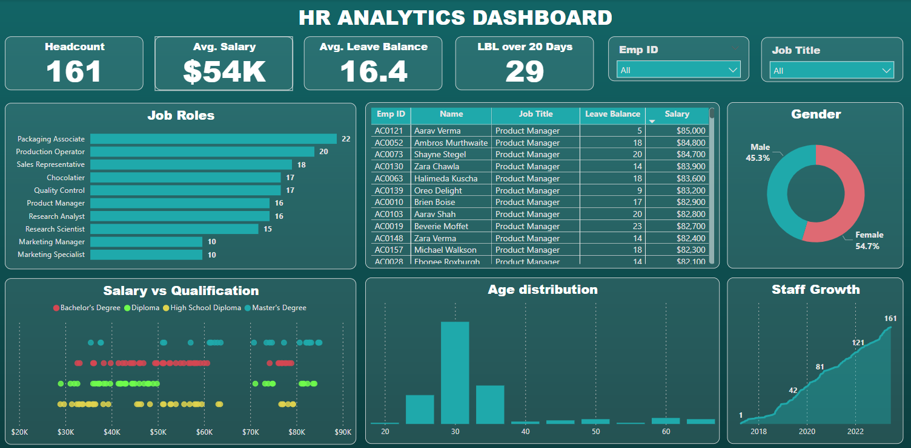
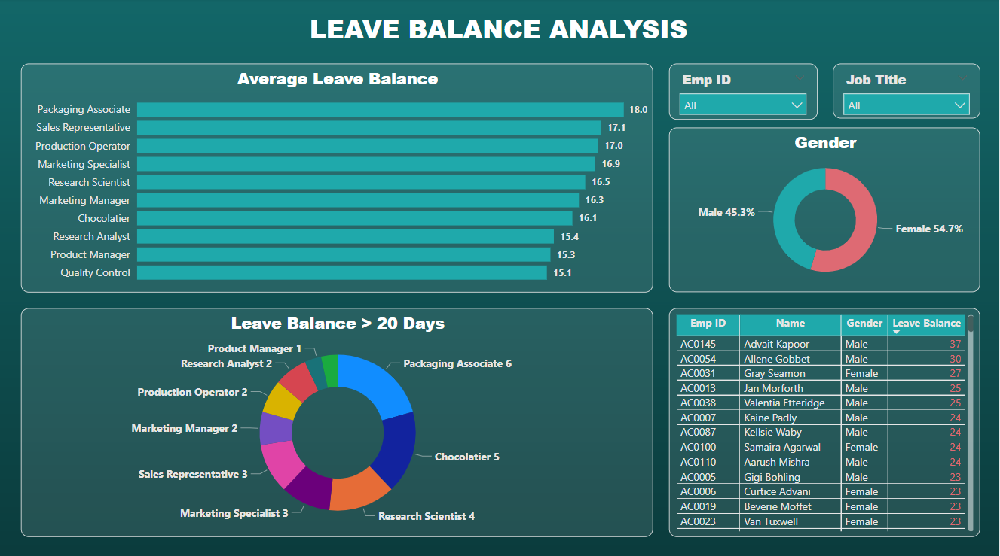

# HR Analytics Dashboard 📊

### Project Overview
This project involves the creation of an HR Analytics Dashboard using Power BI Desktop. The dashboard is designed to provide key insights into HR metrics, including staff composition, salary analysis, and leave balance trends. The goal is to help HR teams and business leaders make data-driven decisions that improve employee management and organizational efficiency.

### Introduction
In this project, I built a comprehensive HR Analytics Dashboard that provides detailed insights into various HR metrics. The dashboard serves as a powerful tool for understanding the workforce's structure, salary distribution, and trends in employee growth and leave balances.

### Steps Followed
The project was completed through the following steps:

#### Loading and Cleaning Data:
- Imported the dataset into Power BI Desktop.
- Cleaned and prepared the data using Power Query to ensure accuracy and consistency.

#### Creating HR Metrics:
- Developed key HR metrics such as headcount, average salary, average leave balance, and more to facilitate detailed analysis.
- Salary and Qualification Comparison:
    - Analyzed the relationship between salary levels and educational qualifications to identify trends and correlations.

#### Customizing Visuals:
- Customized Power BI visuals, including adjustments to colors, axis labels, and legends, to enhance readability and user experience.

#### DAX Calculations:
- Utilized DAX (Data Analysis Expressions) to create advanced metrics, such as cumulative headcount and identifying employees with leave balances exceeding 20 days.

#### Designing the Dashboard:
- Designed a user-friendly HR dashboard that presents the insights in an accessible and visually appealing manner.

### Power BI Dashboard

### Dashboard Insights
The HR Analytics Dashboard provides the following key insights:

- Job Distribution: Visualizes the number of employees in each job category.
- Gender Breakdown: Displays the gender composition of the staff.
- Age Distribution: Shows the age spread of employees across the organization.
- Salary Analysis:
    - Identifies which jobs have the highest pay.
    - Highlights the top earners within each job category.
    - Compares salary levels against educational qualifications.
- Staff Growth Trend: Tracks the growth of staff over time, helping to identify patterns in hiring.
- Leave Balance Analysis: Examines leave balances, with a focus on employees with more than 20 days of leave.

### Conclusion
By providing insights into key HR metrics, this dashboard can help organizations make informed decisions that support their workforce and overall business goals.

### Feedback
Your feedback is valuable! If you have any suggestions or comments on this project, please feel free to share them. Let’s connect and discuss how to improve and expand on these insights.